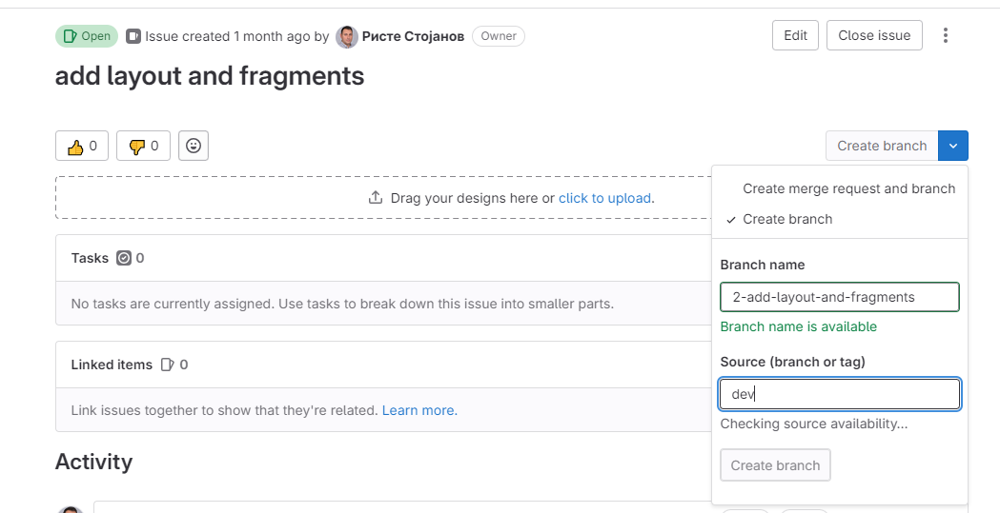

# Starting the database

```sh 
docker-compose up -d finki-db
```

# Populate database with latest schema and data

```sh 
git pull 
```

Then run the common model spring boot application. This should be done regularly in order to have the latest data. 


# General guidelines

For all projects, we use gitflow branching model. The process goes as follows for the students enrolled in the course Web Programming:

1. The professors create issues for each of the projects in the group https://gitlab.finki.ukim.mk/wp
2. The students must log in to the http://gitlab.finki.ukim.mk with their student credentials in order to create an account that can be assigned to the issues.
3. The students can apply to work on multiple issues using the following form: https://forms.office.com/e/QrYTuRmvpT
4. The professors assign the issues to the students.
5. The students create a branch for each issue they are working on. The branch name should be created using the gitlab issue UI from the **dev** branch (see image below).



6. After the students are done with the implementation, they create a merge request to the **dev** branch. 
- The merge request should be created using the gitlab issue UI. 
- The professor should be assigned as reviewer.
- **dev** beranch should be selected as the target branch.
- If there are conflicts, the students should resolve them by merging **dev** branch into their branch and then pushing the changes to the remote branch.
- There should be no more than 30 changed files in a single merge request. 
  - If there are more than 30 files, the merge request will be rejected (exceptions should be accepted by the professor before submitting the request).
- No changes to the database connection configurations are allowed. 
7. The professor reviews the merge request and either accepts it or rejects it. If the merge request contains comments, the students should fix them and push the changes to the remote branch.
8. After the merge request is accepted, there may be additional comments to the task. The students should fix them and push the changes to the same remote branch of the task (if needed, the branch should be recreated).
9. After the task is completed, the students will get the points for the task according to the previous agreement with the professor.